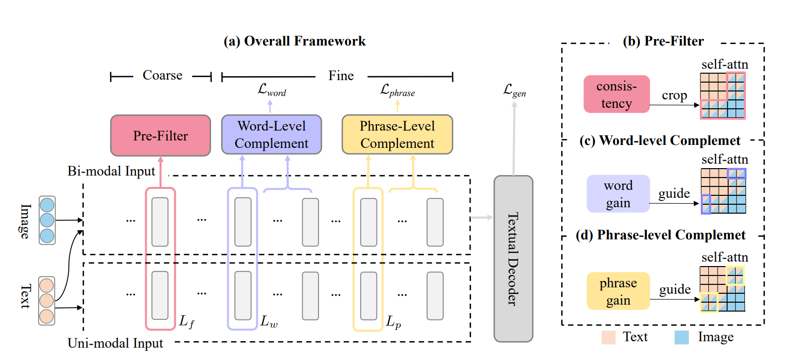

# CFSum: A Coarse-to-Fine Contributions Network for Multimodal Summarization

This is the official repository of [CFSum]() (ACL 2023).



Some code in this repo are copied/modified from opensource implementations made available by [UNITER](https://github.com/ChenRocks/UNITER/tree/master)

The image features are extracted as [UNITER](https://github.com/ChenRocks/UNITER/tree/master). Due to some problems in image feature extraction by [UNITER](https://github.com/ChenRocks/UNITER/tree/master), we tried to restore the image feature extraction process of UNITER. Specifically: 

(1) UNITER uses [BUTD](https://github.com/peteanderson80/bottom-up-attention) image feature extractor faster-rcnn, thus we use [BUTD docker](https://hub.docker.com/r/airsplay/bottom-up-attention) to extract image feature; 

(2) The checkpoint of the faster-rcnn model is derived from the [pretrain-model](https://storage.googleapis.com/up-down-attention/resnet101_faster_rcnn_final.caffemodel) provided by [BUTD](https://github.com/peteanderson80/bottom-up-attention).

## Requirements

Please install the following:

  - [nvidia driver](https://docs.nvidia.com/cuda/cuda-installation-guide-linux/index.html#package-manager-installation) (11.1), 
  - python 3.6.13
  - torch 1.8


We only support Linux with NVIDIA GPUs. We test on Ubuntu 16.04 and 3090 cards.

## Quick Start

*NOTE*: Please refer to [UNITER](https://github.com/ChenRocks/UNITER/tree/master) `bash scripts/download_pretrained.sh $PATH_TO_STORAGE` to get pretrained
checkpoints. This will download both the base and large models.

* **Data preparation**

  1. Dataset download: Download the dataset from [ZNLP/ZNLP-Dataset (github.com)](https://github.com/ZNLP/ZNLP-Dataset) or the google driver https://drive.google.com/file/d/14LoM5-6h1eFa9-NAPuAJnAIyNXF8xNpu/view

  2. Feature Extract: Utilize the [BUTD](https://hub.docker.com/r/chenrocks/butd-caffe) to extract the feature of images, the data format can refer to `./example`

  3. Download pre-trained [UNITER](https://github.com/ChenRocks/UNITER) checkpoint: `>> sh ./utils/download_pretrained_uniter.sh`. 

* **train**

  * First, init the model with `python train.py ./configs/base_multi.py`, and save the model checkpoint.

  * Second, use the above checkpoint to init the model. Specifically, setting `model_init_path` with the path of the checkpoint.

  * Begin training:

    ```
    python train.py ./configs/CFSum_F3W6P9.json
    ```

* **test**

  * Begin testing:

    ```
    python inference.py ./configs/CFSum_F3W6P9.json ./output/train_dir/model_path
    ```

    The results will be saved in `./output/train_dir/hyp.txt`


## Evaluation

We use the [files2rouge]([ZNLP/ZNLP-Dataset (github.com)](https://github.com/pltrdy/files2rouge)) to evaluate the performance of generated summary:

```
>> files2rouge /path_of_test_title.txt hyp.txt
```


## Docker Fetch

1. docker install on Ubuntu: refer to [blog]([Ubuntu · Docker -- 从入门到实践 (docker-practice.github.io)](https://docker-practice.github.io/zh-cn/install/ubuntu.html))

如果遇到镜像无法下载，可使用国内镜像：[Docker快速入门二：Docker配置国内镜像源、常用命令_docker设置镜像-CSDN博客](https://blog.csdn.net/houpk999/article/details/106693215)

[Docker将镜像导出到本地,上传至内网服务器上-腾讯云开发者社区-腾讯云 (tencent.com)](https://cloud.tencent.com/developer/article/2161247)

镜像导入导出： https://blog.csdn.net/u010797364/article/details/120430270

